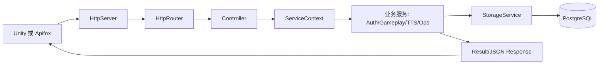

# RedCultureService 从 0 阅读指南

## 一、第一个文件看哪里

第一个文件看这里：

```text
app/redculture_server/main.cpp
```

原因很简单：这个文件是 `redculture_server` 可执行程序的入口。你想知道服务怎么启动、配置怎么加载、HTTP 端口从哪里来、数据库连接怎么传进去、日志怎么初始化，都从这里开始。

不要一开始就看这些地方：

| 不建议先看 | 原因 |
| --- | --- |
| `include/rcs/*` | 这里是公共能力库，模块很多，一开始看会迷路 |
| `src/*` | 这里是公共能力实现，不知道调用入口时很难判断哪些代码真的被用到 |
| `example/*` | 示例程序不是正式后端入口，只适合后面验证模块 |
| `database/schema.sql` | 数据库很重要，但要先知道谁在调用数据库 |
| `conanfile.py` | 三方库依赖信息，作用类似于Java与Maven，但不是业务调用链入口 |

从 0 阅读的主线是：

```text
main.cpp
  -> config/app.yaml
  -> ServiceApplication
  -> registerServerRoutes
  -> Controller
  -> include/rcs 公共服务
  -> src 公共实现
  -> StorageService
  -> database/schema.sql
```

## 二、这个项目到底是什么

RedCultureService 是 Unity 红色文化项目的 C++ 后端服务。

| Unity 需求 | 后端能力 |
| --- | --- |
| 注册 | 创建用户，bcrypt 保存密码 hash，写入 PostgreSQL |
| 登录 | 校验账号密码，签发 JWT，创建内存会话，记录登录日志 |
| 答题互动 | 创建互动流程，生成题目，提交答案，生成 AI 讲解 |
| AI 语音讲解 | 讲解文本转 TTS 音频资源，返回 `audio_url` |
| 健康检查 | 提供 health、ready、version、metrics |
| 接口测试 | 支持 Apifox/Postman/Unity 通过 HTTP JSON 调用 |

当前服务的最终可执行程序是：

```text
redculture_server
```

对应源码目录是：

```text
app/redculture_server
```

## 三、 先建立一张脑内地图

一次 Unity HTTP 请求进入后端后，大体会这样流动：



你读代码时要一直带着这个问题：

```text
当前这个文件处在请求链路的哪一层？
```

| 层级 | 典型文件 | 责任 |
| --- | --- | --- |
| 进程入口 | `app/redculture_server/main.cpp` | 读取配置，初始化日志，创建应用，启动服务 |
| 应用装配 | `service_application.hpp/cpp` | 创建所有服务，连接数据库，注册路由 |
| API 路由 | `server_routes.cpp` | 把各个 Controller 挂到 Router 上 |
| Controller | `auth_controller.cpp` 等 | 解析 HTTP JSON，调用服务，组装响应 |
| 公共服务头文件 | `include/rcs/<module>` | 定义模块对外能力和数据结构 |
| 公共服务实现 | `src/<module>` | 实现真正的业务逻辑 |
| 数据库 | `storage_service.cpp`、`schema.sql` | PostgreSQL 连接、建表、读写数据 |

## 四、第 1 阶段：先看构建入口

在读业务前，先用 10 分钟确认这个项目是怎么编译出来的。

### 4.1 根 CMake

先看：

```text
CMakeLists.txt
```

重点看这些内容：

| 要看什么 | 为什么 |
| --- | --- |
| `project(RedCultureService ...)` | 确认项目语言和 C++ 标准 |
| `find_package(...)` | 确认依赖来自 Conan/CMake |
| `add_subdirectory(src)` | 公共服务库从这里进入 |
| `add_subdirectory(app)` | 可执行应用从这里进入 |
| `RCS_BUILD_SERVER` | 控制是否构建正式后端服务 |
| `RCS_BUILD_EXAMPLES` | 控制是否构建示例程序 |

你看完应该知道：项目不是单文件程序，而是由公共库 `RedCulture::service` 加应用层 `RedCulture::server_app` 组成。

### 4.2 Conan 依赖

再看：

```text
conanfile.py
```

重点看：

| 依赖 | 你需要知道的用途 |
| --- | --- |
| `boost` | HTTP/TCP 网络基础，主要用 Asio/Beast |
| `nlohmann_json` | Controller 解析 JSON 请求和响应 |
| `yaml-cpp` | 加载 `config/app.yaml` |
| `libpqxx` | 连接 PostgreSQL |
| `jwt-cpp` | 签发和校验 JWT |
| `libxcrypt` | Linux 下密码 hash 验证 |
| `spdlog` | 日志输出 |

你不用一开始研究每个三方库怎么用，只要知道项目为什么需要它们。

### 4.3 公共库 CMake

再看：

```text
src/CMakeLists.txt
```

重点看 `target_sources(redculture_service ...)`。这里列出的 `.cpp` 就是公共服务库真实参与编译的实现文件。

你看完应该知道：`include/rcs` 只是头文件，真正被编进公共库的是 `src/CMakeLists.txt` 里列出的文件。

### 4.4 应用层 CMake

再看：

```text
app/redculture_server/CMakeLists.txt
```

重点看：

| CMake 内容 | 含义 |
| --- | --- |
| `redculture_server_app` | 当前 HTTP 应用层静态库 |
| `redculture_server` | 最终可执行文件 |
| `target_link_libraries(... RedCulture::server_app)` | 可执行文件依赖应用层 |
| `copy_if_different config/app.yaml` | 构建后复制配置文件到可执行文件旁边 |

看完这一阶段，你应该能回答：

```text
redculture_server 这个可执行文件是由哪些源码编译出来的？
```

## 五、 第 2 阶段：从 main.cpp 看服务怎么启动

现在打开：

```text
app/redculture_server/main.cpp
```

这个文件是理解项目的第一主线。不要逐行死抠，按函数块看。

### 5.1 先看 main 函数

从 `int main(int argc, char** argv)` 开始读。

主流程是：

```text
parseCliOptions
  -> resolveConfigPath
  -> ConfigHotReloadService::load
  -> toTelemetryConfig
  -> toApplicationConfig
  -> ServiceApplication app(config)
  -> app.start()
  -> 等待 SIGINT/SIGTERM
```

这条链路告诉你：程序不是把数据库、端口、日志写死在代码里，而是先加载 YAML，再转成应用配置。

### 5.2 再看配置路径怎么找

重点看：

```text
resolveConfigPath
```

它决定服务从哪里读取配置文件。默认会找：

| 顺序 | 路径 |
| --- | --- |
| 1 | 当前工作目录的 `config/app.yaml` |
| 2 | 可执行文件旁边的 `config/app.yaml` |
| 3 | CLion 构建目录回溯到项目根目录的 `config/app.yaml` |
| 4 | 命令行 `--config` 显式指定路径 |

所以后续如果服务启动时报 `load config failed`，第一反应就是检查这个函数和实际运行目录。

### 5.3 再看 YAML 如何转成运行配置

重点看两个函数：

```text
toTelemetryConfig
toApplicationConfig
```

`toTelemetryConfig` 负责把 YAML 的 `logging` 段转成日志配置。

`toApplicationConfig` 负责把 YAML 的 `server/auth/storage/app` 段转成后端运行配置。

看完你应该知道这些参数从哪里来：

| 参数 | 来源 |
| --- | --- |
| HTTP 监听地址 | `config/app.yaml` 的 `server.listen_address` |
| HTTP 端口 | `config/app.yaml` 的 `server.port` |
| PostgreSQL URI | `storage.postgres_uri`，可被 `RCS_POSTGRES_URI` 覆盖 |
| JWT secret | `auth.jwt_secret`，可被 `RCS_JWT_SECRET` 覆盖 |
| 日志文件 | `logging.file_path` |
| 是否允许开发登录 | `app.allow_dev_auth`，可被 `--prod-auth` 关闭 |

### 5.4 然后看配置文件本身

打开：

```text
config/app.yaml
```

重点看这些段：

| 配置段 | 影响什么 |
| --- | --- |
| `app` | 服务名、版本、环境、是否允许开发登录 |
| `server` | HTTP 服务监听地址、端口、线程数、CORS |
| `logging` | 控制台日志、文件日志、日志级别、格式 |
| `auth` | JWT issuer、audience、secret、token 过期时间 |
| `storage` | 是否启用数据库、PostgreSQL URI、自动建表 |
| `ai` | AI provider 预留配置 |
| `voice_tts` | TTS provider 预留配置 |

你看完第 2 阶段应该能回答：

```text
我修改数据库密码、HTTP 端口、日志文件位置时，应该改哪个文件？
```

## 6. 第 3 阶段：看应用如何把模块组装起来

现在看应用层头文件：

```text
app/redculture_server/include/redculture_server/application/service_application.hpp
```

重点看两个结构体：

| 类型 | 作用 |
| --- | --- |
| `ApplicationConfig` | 后端运行配置，来自 YAML/环境变量/命令行 |
| `ServiceContext` | 所有 Controller 共用的服务上下文 |

`ServiceContext` 非常重要。Controller 不会自己 new 数据库、new 鉴权服务，而是通过 `ServiceContext` 拿服务对象。

接着看实现文件：

```text
app/redculture_server/src/application/service_application.cpp
```

### 6.1 看构造函数

重点看：

```text
ServiceApplication::ServiceApplication(ApplicationConfig config)
```

它做了几件事：

| 步骤 | 说明 |
| --- | --- |
| 创建 `SessionAuthService` | 负责 JWT 和内存会话 |
| 创建 `RoomMatchService` | 负责房间和匹配 |
| 创建 `AiOrchestratorService` | 负责 AI 任务编排 |
| 创建 `VoiceTtsService` | 负责 TTS 和音频缓存 |
| 条件创建 `StorageService` | `enable_storage` 为 true 时才创建数据库服务 |
| 创建 `CulturalInteractionService` | 组合房间、AI、TTS、Storage，形成答题互动能力 |
| 创建 `OpsService` | 健康检查、ready、version、metrics |
| 注册 health check | 让 `/api/v1/ops/health` 能看到各模块状态 |
| 注册 metrics exporter | 让 `/api/v1/ops/metrics` 返回 Prometheus 文本 |
| 调用 `registerServerRoutes` | 挂载所有 HTTP Controller |
| 创建 `HttpServer` | 真正监听端口的 HTTP 服务 |

这就是项目的“装配中心”。如果你以后新增一个业务模块，大概率要在这里创建服务并放进 `ServiceContext`。

### 6.2 看 start 函数

重点看：

```text
ServiceApplication::start()
```

启动顺序是：

```text
ops_service->start()
  -> storage_service->connect()
  -> http_server_->start()
  -> ops_service->setReady(true)
```

如果注册接口报 503，并且提示 storage disabled/disconnected，就从这里开始追。

你看完第 3 阶段应该能回答：

```text
一个 Controller 为什么能访问 auth_service、storage_service、gameplay_service？
```

答案是：它们都在 `ServiceContext` 里，由 `ServiceApplication` 创建并传入。

## 7. 第 4 阶段：看路由怎么挂上去

现在看：

```text
app/redculture_server/src/api/server_routes.cpp
```

这个文件很短，但很关键。它做的事情是：

```text
创建 AuthController
创建 RoomController
创建 InteractionController
创建 TtsController
创建 OpsController
调用每个 controller 的 registerRoutes(router)
```

你看完这个文件，就知道所有 HTTP API 是从哪里挂进去的。

然后分别看每个 Controller 的 `registerRoutes`：

| Controller | 文件 | 路由 |
| --- | --- | --- |
| AuthController | `auth_controller.cpp` | `/api/v1/auth/register`、`/api/v1/auth/login` |
| InteractionController | `interaction_controller.cpp` | `/api/v1/interactions/start`、`/api/v1/interactions/answer` |
| TtsController | `tts_controller.cpp` | `/api/v1/tts/audio` |
| RoomController | `room_controller.cpp` | `/api/v1/rooms/create`、`/api/v1/rooms/join`、`/api/v1/rooms` |
| OpsController | `ops_controller.cpp` | `/api/v1/ops/health`、`ready`、`version`、`metrics`、`shutdown` |

这一步你应该形成一个习惯：

```text
想知道某个接口做什么，先找 Controller::registerRoutes，再跳到具体处理函数。
```

## 8. 第 5 阶段：看 HTTP 基础设施

不要一开始就看 HTTP Server，等你知道路由怎么注册后再看。

按这个顺序看：

```text
include/rcs/http/http_types.hpp
include/rcs/http/http_router.hpp
src/http/http_router.cpp
include/rcs/http/http_server.hpp
src/http/http_server.cpp
```

### 8.1 `http_types.hpp`

看 `HttpRequest` 和 `HttpResponse`。

你需要理解：Controller 收到的是项目自己封装的 `HttpRequest`，返回的是项目自己封装的 `HttpResponse`，不是直接操作 Boost.Beast 的 request/response。

### 8.2 `http_router.hpp/cpp`

看 `HttpRouter::get`、`HttpRouter::post`、`HttpRouter::route`。

它相当于 C++ 版本的简化 `@RequestMapping`。

SpringBoot 里你会写：

```java
@PostMapping("/api/v1/auth/register")
```

这个项目里对应写法是：

```cpp
router.post("/api/v1/auth/register", [self](const http::HttpRequest& request) {
    return self->registerUser(request);
});
```

### 8.3 `http_server.cpp`

最后看 `HttpServer` 实现。

重点看：

| 逻辑 | 为什么重要 |
| --- | --- |
| 接收 HTTP 请求 | Unity/Apifox 请求从这里进来 |
| 最大 body 限制 | 防止请求体过大 |
| CORS 处理 | Unity WebGL 或浏览器调试会用到 |
| 调用 router | 把请求交给 Controller |
| `http_access` 日志 | 每次接口调用都会有日志 |
| 异常捕获 | Controller 抛异常时返回 500 |

看完第 5 阶段，你应该知道一个请求是怎么从 TCP/HTTP 层走到 Controller 的。

## 9. 第 6 阶段：看 API 工具函数

在读具体接口前，先看：

```text
app/redculture_server/include/redculture_server/api/http_utils.hpp
app/redculture_server/src/api/http_utils.cpp
```

这个文件提供了 Controller 共用工具：

| 函数 | 作用 |
| --- | --- |
| `parseJsonBody` | 解析 JSON 请求体 |
| `successResponse` | 返回统一成功 JSON |
| `errorResponseAt` | 返回错误 JSON，并记录文件行号日志 |
| `readStringOr` | 从 JSON 中安全读取字符串 |
| `readUint64Or` | 从 JSON 中安全读取整数 |
| `bearerToken` | 从 Authorization header 取 token |
| `resolvePlayer` | 优先 token 解析玩家，本地开发允许 body.player_id |

特别重要的是：

```text
RCS_API_ERROR_RESPONSE
```

Controller 用它返回错误时，会记录具体代码行号。这就是你之前要求“日志报错具体到代码行数”的实现入口。

## 10. 第 7 阶段：完整追一遍注册接口

现在开始读第一个业务接口。建议先读注册，因为它覆盖了 JSON、校验、密码、JWT、数据库、日志。

入口文件：

```text
app/redculture_server/src/api/controllers/auth_controller.cpp
```

### 10.1 先看路由

找到：

```text
AuthController::registerRoutes
```

你会看到：

```text
POST /api/v1/auth/register -> registerUser
POST /api/v1/auth/login    -> login
```

所以注册接口处理函数是：

```text
AuthController::registerUser
```

### 10.2 追 registerUser

`registerUser` 的逻辑顺序是：

```text
parseJsonBody
  -> parseRegisterRequest
  -> 校验 account/password/player_id/display_name
  -> storageUnavailableMessage
  -> findUser / findUserByAccount
  -> hashPasswordBcrypt
  -> storage_service->createUser
  -> auth_service->issueToken
  -> auth_service->loginWithToken
  -> persistLoginSession
  -> successResponse
```

这一条链路对应文件如下：

| 步骤 | 文件 |
| --- | --- |
| 解析注册 JSON | `auth_controller.cpp` |
| 构造统一响应 | `http_utils.cpp` |
| 检查数据库状态 | `auth_controller.cpp` |
| bcrypt 密码 hash | `src/auth/password_hasher.cpp` |
| 用户写入数据库 | `src/storage/storage_service.cpp` |
| JWT 签发和会话 | `src/auth/session_auth_service.cpp` |
| 表结构 | `database/schema.sql` |

### 10.3 继续看 Auth 公共服务

注册里调用了 `auth_service`，所以接着看：

```text
include/rcs/auth/session_auth_service.hpp
src/auth/session_auth_service.cpp
```

重点看：

| 函数 | 说明 |
| --- | --- |
| `issueToken` | 签发 JWT |
| `validateToken` | 校验 JWT |
| `loginWithToken` | token 合法后创建或刷新内存会话 |
| `findSessionByPlayer` | 根据玩家查内存会话 |
| `sweepExpiredSessions` | 清理过期会话 |

然后看密码：

```text
include/rcs/auth/password_hasher.hpp
src/auth/password_hasher.cpp
```

重点看：

| 函数 | 说明 |
| --- | --- |
| `hashPasswordBcrypt` | 把明文密码转成 hash |
| `verifyPasswordBcrypt` | 登录时校验明文密码和 hash 是否匹配 |

### 10.4 最后看 Storage

注册最终要写 PostgreSQL，所以看：

```text
include/rcs/storage/storage_service.hpp
src/storage/storage_service.cpp
database/schema.sql
```

注册会重点用到：

| 方法 | 说明 |
| --- | --- |
| `connect` | 连接 PostgreSQL |
| `migrate` | 自动建表/补字段 |
| `findUser` | 按 player_id 查询 |
| `findUserByAccount` | 按 account 查询 |
| `createUser` | 创建用户 |
| `appendPlayerSession` | 记录登录会话 |
| `appendEventLog` | 写业务事件日志 |

注册写入的主表是：

```text
rcs_users
```

会话记录表是：

```text
rcs_player_sessions
```

业务日志表是：

```text
rcs_event_logs
```

## 11. 第 8 阶段：完整追一遍登录接口

还是从：

```text
app/redculture_server/src/api/controllers/auth_controller.cpp
```

入口函数：

```text
AuthController::login
```

登录有两种模式：

| 模式 | 条件 | 说明 |
| --- | --- | --- |
| 账号密码登录 | body 中有 `account` 和 `password` | 查询 PostgreSQL，校验 bcrypt hash |
| 开发登录 | body 中只有 `player_id`，且 `allow_dev_auth=true` | 本地联调用，自动签发 token |

账号密码登录链路：

```text
parseLoginRequest
  -> storageUnavailableMessage
  -> storage_service->findUserByAccount
  -> verifyPasswordBcrypt
  -> auth_service->issueToken
  -> auth_service->loginWithToken
  -> persistLoginSession
  -> successResponse
```

你看完注册和登录后，基本就理解了项目最核心的一类接口写法。

## 12. 第 9 阶段：追答题互动接口

Unity 最有业务价值的链路在这里。

先看：

```text
app/redculture_server/src/api/controllers/interaction_controller.cpp
```

路由是：

| 接口 | 函数 |
| --- | --- |
| `POST /api/v1/interactions/start` | `startInteraction` |
| `POST /api/v1/interactions/answer` | `answerInteraction` |

### 12.1 开始互动

`startInteraction` 的链路：

```text
parseJsonBody
  -> resolvePlayer
  -> 组装 StartInteractionRequest
  -> gameplay_service->startInteraction
  -> successResponse
```

接着跳到：

```text
include/rcs/gameplay/cultural_interaction_service.hpp
src/gameplay/cultural_interaction_service.cpp
```

重点看：

```text
CulturalInteractionService::startInteraction
```

它会做这些事：

| 步骤 | 说明 |
| --- | --- |
| 校验 player_id | 确认玩家身份存在 |
| 可选校验 room_id | 如果传了房间，需要确认玩家属于该房间 |
| 创建 interaction_id | 服务端生成互动 ID |
| 调用 AI 生成题目 | 通过 `AiOrchestratorService` |
| 尝试写 PostgreSQL | 保存互动开始记录 |
| 返回 question | 给 Unity 展示题目 |

### 12.2 提交答案

`answerInteraction` 的链路：

```text
parseJsonBody
  -> resolvePlayer
  -> 组装 SubmitAnswerRequest
  -> gameplay_service->submitAnswer
  -> successResponse
```

继续看：

```text
CulturalInteractionService::submitAnswer
```

它会做这些事：

| 步骤 | 说明 |
| --- | --- |
| 找到 interaction | 根据 `interaction_id` 或 `flow_id` 找上下文 |
| 提交答案给 AI flow | 生成讲解文本 |
| 调用 TTS | 把讲解文本转成音频资源 |
| 保存答题记录 | 写 `rcs_answer_records` |
| 更新互动记录 | 写答案、讲解、audio_id、状态 |
| 返回 audio_url | Unity 后续请求音频 |

## 13. 第 10 阶段：看 AI 编排模块

AI 模块先看头文件：

```text
include/rcs/ai_orchestrator/ai_orchestrator_service.hpp
```

再看实现：

```text
src/ai_orchestrator/ai_orchestrator_service.cpp
```

你要重点理解这些概念：

| 概念 | 说明 |
| --- | --- |
| `IAiClient` | 真正调用大模型的 C++ 接口 |
| `AiOrchestratorService` | 管理 AI 任务、流程、重试、状态 |
| `AiInteractionFlow` | 一次题目和讲解的完整互动流程 |
| `AiTask` | 单次 AI 任务，比如生成题目或讲解 |
| `tick` | 推进队列任务执行 |

当前真正注入的 AI client 在：

```text
app/redculture_server/src/application/service_application.cpp
```

里面有一个：

```text
LocalAiClient
```

这是本地 mock。它不会真的请求大模型，只是拼接中文题目和讲解。

以后如果你要接真实大模型，不是重写 Controller，而是新增一个 C++ 类实现：

```text
rcs::ai_orchestrator::IAiClient
```

然后在 `ServiceApplication` 中替换掉 `LocalAiClient`。

## 14. 第 11 阶段：看 TTS 音频模块

先看：

```text
include/rcs/voice_tts/voice_tts_service.hpp
src/voice_tts/voice_tts_service.cpp
```

重点概念：

| 概念 | 说明 |
| --- | --- |
| `ITtsClient` | 真正调用 TTS 服务的 C++ 接口 |
| `VoiceTtsService` | 管理 TTS 任务、重试、缓存 |
| `TtsRequest` | 文本、声音、语言、用途等请求信息 |
| `AudioResource` | 音频 ID、mime、bytes、过期时间 |
| `findAudio` | 根据 `audio_id` 找音频资源 |

当前真正注入的 TTS client 也在：

```text
app/redculture_server/src/application/service_application.cpp
```

里面有：

```text
LocalTtsClient
```

它现在返回的是 mock bytes，不是真正可播放 MP3。所以你看到类似：

```text
FAKE_MP3_AUDIO:...
```

是正常的。等接入真实 TTS 后，`/api/v1/tts/audio` 才会返回真正可播放的音频。

TTS 对外接口在：

```text
app/redculture_server/src/api/controllers/tts_controller.cpp
```

入口是：

```text
TtsController::getAudio
```

## 15. 第 12 阶段：看运维接口和 metrics

先看：

```text
app/redculture_server/src/api/controllers/ops_controller.cpp
```

再看：

```text
include/rcs/ops/ops_service.hpp
src/ops/ops_service.cpp
```

重点接口：

| 接口 | 返回格式 | 说明 |
| --- | --- | --- |
| `/api/v1/ops/health` | JSON | 各组件健康状态 |
| `/api/v1/ops/ready` | JSON | 服务是否 ready |
| `/api/v1/ops/version` | JSON | 版本信息 |
| `/api/v1/ops/metrics` | text/plain | Prometheus 文本格式，不是 JSON |
| `/api/v1/ops/shutdown` | JSON | 请求优雅停机 |

`metrics` 不返回 JSON 是正确的，因为 Prometheus 标准就是文本格式。

metrics 的内容在这里组装：

```text
ServiceApplication::ServiceApplication
```

搜索：

```text
setMetricsExporter
```

## 16. 第 13 阶段：看数据库设计和落库

数据库不要孤立看。你应该先知道哪个业务会写哪张表。

数据库结构在：

```text
database/schema.sql
```

主要表：

| 表 | 谁写入 | 用途 |
| --- | --- | --- |
| `rcs_users` | 注册接口、开发登录补用户 | 用户账号、密码 hash、昵称、头像 |
| `rcs_player_sessions` | 注册后自动登录、登录接口 | 登录会话记录 |
| `rcs_cultural_interactions` | 开始互动、提交答案 | 互动主记录 |
| `rcs_answer_records` | 提交答案 | 答题记录 |
| `rcs_progress_records` | 进度保存预留 | 玩家场景进度 |
| `rcs_tts_audio_resources` | 提交答案生成 TTS 后 | 音频资源索引 |
| `rcs_event_logs` | 登录、房间、TTS 等事件 | 业务日志 |
| `rcs_schema_migrations` | StorageService migrate | schema 版本 |

数据库代码入口：

```text
include/rcs/storage/storage_service.hpp
src/storage/storage_service.cpp
```

如果你想知道某张表在哪里写，直接搜索方法名：

| 表 | 建议搜索 |
| --- | --- |
| `rcs_users` | `createUser`、`upsertUser` |
| `rcs_player_sessions` | `appendPlayerSession` |
| `rcs_cultural_interactions` | `startCulturalInteraction`、`completeCulturalInteraction` |
| `rcs_answer_records` | `appendAnswerRecord` |
| `rcs_tts_audio_resources` | `saveTtsAudioResource` |
| `rcs_event_logs` | `appendEventLog` |

## 17. 第 14 阶段：看日志系统

日志配置先看：

```text
config/app.yaml
```

`logging` 段控制控制台、文件、级别和格式。

日志封装看：

```text
include/rcs/observability/telemetry_service.hpp
src/observability/telemetry_service.cpp
```

重点看：

| 函数 | 说明 |
| --- | --- |
| `TelemetryService::TelemetryService` | 初始化 logger |
| `configureLoggerLocked` | 根据配置创建 console/file sink |
| `writeLogLocked` | 输出结构化日志 |

但是注意：HTTP 访问日志和业务错误日志很多地方直接用 `spdlog`。因为 `TelemetryService` 会设置 default logger，所以这些 `spdlog::info/warn/error` 也会遵守 YAML 中的日志配置。

HTTP 访问日志位置：

```text
src/http/http_server.cpp
```

业务错误日志位置：

```text
app/redculture_server/src/api/http_utils.cpp
```

## 18. 第 15 阶段：看房间和状态同步

这两个模块当前不是 Unity 主要需求，但它们已经存在。

房间模块：

```text
include/rcs/room/room_match_service.hpp
src/room/room_match_service.cpp
app/redculture_server/src/api/controllers/room_controller.cpp
```

状态同步模块：

```text
include/rcs/sync/state_sync_service.hpp
src/sync/state_sync_service.cpp
```

建议后面再读，因为当前 Unity 主要功能是注册、登录、答题互动、AI/TTS。

## 19. 一条完整请求怎么追：注册失败示例

假设注册接口返回：

```json
{
  "code": 503,
  "msg": "storage is disconnected for register: ...",
  "data": null
}
```

追代码顺序：

```text
1. app/redculture_server/src/api/controllers/auth_controller.cpp
   -> AuthController::registerUser

2. 找 storageUnavailableMessage
   -> 判断 storage_service 是否存在、是否 connected

3. app/redculture_server/src/application/service_application.cpp
   -> ServiceApplication::start
   -> storage_service->connect()

4. config/app.yaml
   -> storage.enabled
   -> storage.postgres_uri

5. src/storage/storage_service.cpp
   -> StorageService::connect

6. PostgreSQL 本身
   -> 用户名、密码、数据库名、端口是否正确
```

这样你就不会在 Controller 里反复找错误，因为真正的错误可能发生在启动阶段的数据库连接。

## 20. 一条完整请求怎么追：答题互动示例

假设 Unity 调用：

```text
POST /api/v1/interactions/answer
```

追代码顺序：

```text
1. app/redculture_server/src/api/controllers/interaction_controller.cpp
   -> InteractionController::answerInteraction

2. app/redculture_server/src/api/http_utils.cpp
   -> resolvePlayer

3. src/gameplay/cultural_interaction_service.cpp
   -> CulturalInteractionService::submitAnswer

4. src/ai_orchestrator/ai_orchestrator_service.cpp
   -> AiOrchestratorService::submitAnswer / tick

5. src/voice_tts/voice_tts_service.cpp
   -> VoiceTtsService::submit / tick

6. src/storage/storage_service.cpp
   -> completeCulturalInteraction / appendAnswerRecord / saveTtsAudioResource

7. app/redculture_server/src/api/controllers/tts_controller.cpp
   -> 根据返回的 audio_url 获取音频
```

## 21. 如果你要新增一个接口，应该怎么读和改

假设你要新增：

```text
GET /api/v1/users/profile
```

建议步骤：

| 步骤 | 文件 | 做什么 |
| --- | --- | --- |
| 1 | `include/rcs/storage/storage_service.hpp` | 确认是否已有查询用户方法 |
| 2 | `src/storage/storage_service.cpp` | 如果没有，新增查询实现 |
| 3 | `app/redculture_server/include/redculture_server/api/controllers` | 新增或扩展 Controller 头文件 |
| 4 | `app/redculture_server/src/api/controllers` | 写 HTTP 处理函数 |
| 5 | `app/redculture_server/src/api/server_routes.cpp` | 确保 controller 被创建并注册 |
| 6 | `app/redculture_server/CMakeLists.txt` | 新增 cpp 时加入 target_sources |
| 7 | `docs/测试相关` | 增加接口测试 JSON 和说明 |

不要把所有逻辑写在 Controller 里。Controller 应该负责 HTTP 层，公共逻辑尽量沉到 `include/rcs` 和 `src`。

## 22. 推荐的第一次阅读计划

如果你只有 1 小时，按这个顺序看：

| 时间 | 文件 | 目标 |
| --- | --- | --- |
| 10 分钟 | `CMakeLists.txt`、`app/redculture_server/CMakeLists.txt` | 知道可执行文件怎么编出来 |
| 15 分钟 | `app/redculture_server/main.cpp`、`config/app.yaml` | 知道服务怎么启动，配置从哪里来 |
| 15 分钟 | `service_application.hpp/cpp` | 知道各服务怎么被创建和注入 |
| 10 分钟 | `server_routes.cpp`、`auth_controller.cpp` | 知道接口怎么注册和处理 |
| 10 分钟 | `storage_service.hpp`、`database/schema.sql` | 知道用户数据怎么落库 |

如果你有半天，按这个顺序：

| 顺序 | 内容 |
| --- | --- |
| 1 | 完成上面的 1 小时路线 |
| 2 | 追完整注册接口 |
| 3 | 追完整登录接口 |
| 4 | 追完整答题互动接口 |
| 5 | 看 AI/TTS mock 如何注入 |
| 6 | 用 Apifox 调一次接口，然后对照日志追代码 |

## 23. 文件速查表

| 我想理解 | 从这里开始 |
| --- | --- |
| 程序怎么启动 | `app/redculture_server/main.cpp` |
| 配置怎么加载 | `main.cpp`、`include/rcs/config_hotreload/config_hotreload_service.hpp`、`src/config_hotreload/config_hotreload_service.cpp` |
| HTTP 端口在哪里配 | `config/app.yaml` 的 `server.port` |
| 数据库在哪里配 | `config/app.yaml` 的 `storage.postgres_uri` |
| 日志在哪里配 | `config/app.yaml` 的 `logging` |
| 所有服务在哪里创建 | `app/redculture_server/src/application/service_application.cpp` |
| 所有路由在哪里注册 | `app/redculture_server/src/api/server_routes.cpp` |
| 注册登录接口 | `app/redculture_server/src/api/controllers/auth_controller.cpp` |
| 答题互动接口 | `app/redculture_server/src/api/controllers/interaction_controller.cpp` |
| TTS 音频接口 | `app/redculture_server/src/api/controllers/tts_controller.cpp` |
| 健康检查接口 | `app/redculture_server/src/api/controllers/ops_controller.cpp` |
| 统一 JSON 响应 | `app/redculture_server/src/api/http_utils.cpp` |
| JWT 和会话 | `src/auth/session_auth_service.cpp` |
| 密码 hash | `src/auth/password_hasher.cpp` |
| PostgreSQL | `src/storage/storage_service.cpp` |
| 数据库表结构 | `database/schema.sql` |
| AI 任务编排 | `src/ai_orchestrator/ai_orchestrator_service.cpp` |
| TTS 缓存和任务 | `src/voice_tts/voice_tts_service.cpp` |
| HTTP Server 底层 | `src/http/http_server.cpp` |
| HTTP Router | `src/http/http_router.cpp` |

## 24. 最后再看 example

`example` 目录适合在你理解主链路之后再看。

| 示例 | 用途 |
| --- | --- |
| `example/3rdpatryexample` | 验证三方库是否链接成功 |
| `example/auth_example` | 单独验证鉴权模块 |
| `example/gameplay_example` | 单独验证答题互动流程 |
| `example/storage_example` | 单独验证 PostgreSQL 存储 |
| `example/http_api_example` | 单独验证 HTTP API 能力 |

正式联调 Unity 时，入口仍然是：

```text
redculture_server
```

不是 example 程序。

## 25. 读代码时的判断标准

读完这份文档和对应代码后，你应该能回答这些问题：

| 问题 | 应该能定位到哪里 |
| --- | --- |
| 服务启动时为什么读不到数据库？ | `main.cpp`、`config/app.yaml`、`ServiceApplication::start` |
| 注册接口为什么返回 503？ | `AuthController::registerUser`、`storageUnavailableMessage`、`StorageService::connect` |
| 登录后 token 从哪里来？ | `SessionAuthService::issueToken` |
| 密码为什么不是明文？ | `password_hasher.cpp` |
| Unity 的 JSON 请求在哪里解析？ | `http_utils.cpp`、Controller |
| 业务错误为什么带代码行号？ | `RCS_API_ERROR_RESPONSE`、`errorResponseAt` |
| metrics 为什么不是 JSON？ | `OpsController::metrics`、`OpsService::metricsResponse` |
| AI 现在为什么像 mock？ | `LocalAiClient` |
| TTS 为什么现在不能播放真实语音？ | `LocalTtsClient` |
| 新增接口应该写在哪里？ | Controller + 公共服务 + route + CMake |

## 26. 最短路径总结

如果你只记一条路线，就记这条：

```text
app/redculture_server/main.cpp
  -> config/app.yaml
  -> app/redculture_server/src/application/service_application.cpp
  -> app/redculture_server/src/api/server_routes.cpp
  -> app/redculture_server/src/api/controllers/auth_controller.cpp
  -> app/redculture_server/src/api/http_utils.cpp
  -> src/auth/session_auth_service.cpp
  -> src/storage/storage_service.cpp
  -> database/schema.sql
```

这条路线能让你从 0 理解：服务如何启动、配置如何注入、接口如何注册、请求如何处理、用户如何注册登录、数据如何写入 PostgreSQL。